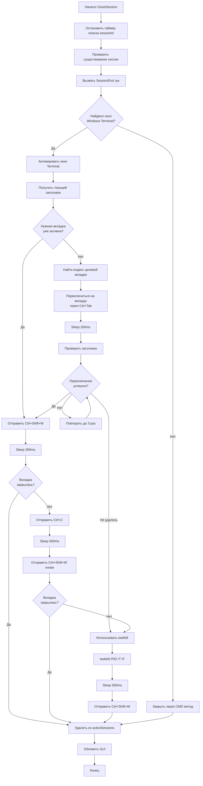

# План исправления функции CloseSession для Windows Terminal

## Описание проблем

### Проблема 1: Вкладка не закрывается после завершения процесса

**Текущее поведение:**
1. Вызывается `taskkill /PID {pid} /T /F` (строка 1710)
2. Процесс cmd.exe завершается
3. Вкладка показывает сообщение "[процесс завершил работу с кодом 1]"
4. Отправляется `Ctrl+Shift+W` (строка 1761)
5. **Вкладка НЕ закрывается**, т.к. в ней уже нет активного процесса

**Причина:** Windows Terminal не закрывает вкладку по `Ctrl+Shift+W`, если в ней показывается сообщение о завершении процесса.

### Проблема 2: Закрывается не та вкладка

**Текущее поведение:**
1. Активна вкладка "Claude Code Launcher"
2. Нажимаем кнопку закрытия для вкладки "BTMonitor"
3. Активируется окно Terminal (строка 1715)
4. Начинается переключение через `Ctrl+Tab` (строка 1749)
5. В строку ввода активной вкладки попадает буква "e"
6. Закрывается активная вкладка "Claude Code Launcher"
7. Вкладка "BTMonitor" остаётся открытой

**Причина:** 
- Процесс уже завершён через `taskkill`, но он всё ещё учитывается при подсчёте вкладок (строка 1728-1744)
- `Ctrl+Tab` отправляется слишком быстро, команды попадают в неправильную вкладку
- Нет проверки успешности переключения

## Решение

### Изменение 1: Изменить порядок операций

**Было:**
```
taskkill → Sleep(300) → Активация окна → Переключение вкладки → Ctrl+Shift+W
```

**Станет:**
```
Активация окна → Переключение вкладки → Ctrl+Shift+W → Проверка закрытия → taskkill (если нужно)
```

### Изменение 2: Улучшить логику переключения вкладок

**Проблемы текущей реализации:**
- Подсчитывает ВСЕ процессы cmd.exe с "cc" и "--name"
- Включает уже завершённые процессы
- Не проверяет успешность переключения

**Новая логика:**
1. Активировать окно Terminal
2. Получить текущий заголовок
3. Если нужная вкладка уже активна → закрыть через `Ctrl+Shift+W`
4. Если нет → использовать прямое переключение по индексу вкладки
5. Проверить успешность переключения
6. Закрыть через `Ctrl+Shift+W`
7. Если вкладка не закрылась → использовать `taskkill`

### Изменение 3: Использовать API Windows Terminal (если возможно)

Windows Terminal поддерживает команды через `wt.exe`:
- `wt.exe -w 0 close-tab` - закрыть текущую вкладку

Но это требует, чтобы вкладка была активна.

## Диаграмма нового алгоритма



## Детальный план изменений

### Шаг 1: Изменить определение активной вкладки

**Файл:** [`ClaudeCodeLauncher.ahk`](ClaudeCodeLauncher.ahk:1666)

**Строки 1666-1675:** Текущая проверка только по заголовку

**Изменить на:**
```ahk
; Ищем окно Windows Terminal
wtHwnd := WinExist("ahk_exe WindowsTerminal.exe")
if (wtHwnd) {
    isWindowsTerminal := true
    terminalHwnd := wtHwnd
    Log("Найдено окно Windows Terminal: HWND=" terminalHwnd)
}
```

Убрать проверку `if InStr(title, folderName)` - она не нужна на этом этапе.

### Шаг 2: Переписать логику закрытия для Windows Terminal

**Файл:** [`ClaudeCodeLauncher.ahk`](ClaudeCodeLauncher.ahk:1706)

**Строки 1706-1765:** Полностью переписать блок

**Новая логика:**

```ahk
if (isWindowsTerminal) {
    Log("Закрытие вкладки Windows Terminal: PID=" pid)
    
    ; Активируем окно Windows Terminal
    WinActivate("ahk_id " terminalHwnd)
    Sleep(200)
    
    ; Получаем имя папки для поиска вкладки
    folderName := GetFolderName(folderPath)
    currentTitle := WinGetTitle("ahk_id " terminalHwnd)
    Log("Текущий заголовок: " currentTitle)
    
    ; Проверяем, активна ли нужная вкладка
    isTargetTabActive := InStr(currentTitle, folderName)
    
    if (!isTargetTabActive) {
        Log("Переключение на вкладку: " folderName)
        
        ; Пытаемся переключиться на нужную вкладку (до 3 попыток)
        switchSuccess := false
        loop 3 {
            ; Переключаемся на следующую вкладку
            Send("^{Tab}")
            Sleep(250)
            
            ; Проверяем заголовок
            newTitle := WinGetTitle("ahk_id " terminalHwnd)
            Log("Попытка " A_Index ": " newTitle)
            
            if InStr(newTitle, folderName) {
                Log("Успешно переключились на нужную вкладку")
                switchSuccess := true
                break
            }
            
            ; Если вернулись к исходной вкладке, прерываем
            if (newTitle = currentTitle && A_Index > 1) {
                Log("Вернулись к исходной вкладке, прерываем поиск")
                break
            }
        }
        
        if (!switchSuccess) {
            Log("Не удалось переключиться на вкладку, используем принудительное завершение", "WARN")
            ; Завершаем процесс напрямую
            RunWait('taskkill /PID ' pid ' /T /F', , "Hide")
            Log("Процесс завершён через taskkill")
            ; Не пытаемся закрыть вкладку
            goto CleanupSession
        }
    }
    
    ; Закрываем вкладку через Ctrl+Shift+W
    Log("Отправка Ctrl+Shift+W для закрытия вкладки")
    Send("^+w")
    Sleep(300)
    
    ; Проверяем, закрылась ли вкладка (процесс должен завершиться)
    tabClosed := false
    loop 10 {
        if !ProcessExist(pid) {
            Log("Вкладка закрыта, процесс завершён")
            tabClosed := true
            break
        }
        Sleep(100)
    }
    
    if (!tabClosed) {
        Log("Вкладка не закрылась, пробуем Ctrl+C + Ctrl+Shift+W", "WARN")
        
        ; Отправляем Ctrl+C для прерывания процесса
        Send("^c")
        Sleep(500)
        
        ; Пробуем закрыть вкладку снова
        Send("^+w")
        Sleep(300)
        
        ; Проверяем снова
        loop 10 {
            if !ProcessExist(pid) {
                Log("Вкладка закрыта после Ctrl+C")
                tabClosed := true
                break
            }
            Sleep(100)
        }
        
        if (!tabClosed) {
            Log("Принудительное завершение через taskkill", "WARN")
            RunWait('taskkill /PID ' pid ' /T /F', , "Hide")
            Sleep(300)
            
            ; Пробуем закрыть вкладку в последний раз
            Send("^+w")
            Sleep(200)
        }
    }
}

CleanupSession:
```

### Шаг 3: Добавить метку для очистки

После блока try-catch добавить метку `CleanupSession:` перед удалением из `activeSessions`.

### Шаг 4: Улучшить функцию поиска вкладки

Создать отдельную функцию для переключения на нужную вкладку:

```ahk
; === ПЕРЕКЛЮЧЕНИЕ НА ВКЛАДКУ WINDOWS TERMINAL ===
SwitchToTerminalTab(terminalHwnd, targetFolderName, maxAttempts := 10) {
    Log("Поиск вкладки: " targetFolderName)
    
    currentTitle := WinGetTitle("ahk_id " terminalHwnd)
    startTitle := currentTitle
    
    ; Если уже на нужной вкладке
    if InStr(currentTitle, targetFolderName) {
        Log("Вкладка уже активна")
        return true
    }
    
    ; Перебираем вкладки
    loop maxAttempts {
        Send("^{Tab}")
        Sleep(250)
        
        newTitle := WinGetTitle("ahk_id " terminalHwnd)
        Log("Проверка вкладки " A_Index ": " newTitle)
        
        if InStr(newTitle, targetFolderName) {
            Log("Найдена нужная вкладка на попытке " A_Index)
            return true
        }
        
        ; Если вернулись к начальной вкладке, значит прошли полный круг
        if (newTitle = startTitle && A_Index > 1) {
            Log("Прошли все вкладки, целевая не найдена")
            return false
        }
    }
    
    Log("Не удалось найти вкладку за " maxAttempts " попыток")
    return false
}
```

## Тестирование

### Тест 1: Закрытие активной вкладки
1. Открыть 4 сессии
2. Активировать вкладку "Kimmy-WoW-Launcher"
3. Нажать кнопку закрытия в лаунчере
4. **Ожидается:** Вкладка закрывается, процесс завершается

### Тест 2: Закрытие неактивной вкладки
1. Открыть 4 сессии
2. Активировать вкладку "Claude Code Launcher"
3. Нажать кнопку закрытия для "BTMonitor" в лаунчере
4. **Ожидается:** Закрывается вкладка "BTMonitor", активная вкладка остаётся без изменений

### Тест 3: Закрытие нескольких вкладок подряд
1. Открыть 4 сессии
2. Закрыть их по очереди через лаунчер
3. **Ожидается:** Все вкладки закрываются корректно

## Альтернативное решение

Если основное решение не сработает, можно использовать:

### Вариант A: Использовать wt.exe для закрытия вкладки

```ahk
; Получить индекс вкладки и закрыть через wt.exe
Run('wt.exe -w 0 move-focus --target ' tabIndex, , "Hide")
Sleep(200)
Run('wt.exe -w 0 close-tab', , "Hide")
```

### Вариант B: Использовать UI Automation

Использовать COM API для доступа к элементам UI Windows Terminal и программно закрыть вкладку.

### Вариант C: Не закрывать вкладку автоматически

Просто завершать процесс через `taskkill` и оставлять вкладку с сообщением о завершении. Пользователь закроет её вручную через `Ctrl+D` или `Enter`.

## Приоритет изменений

1. **Высокий:** Изменить порядок операций (не использовать taskkill до попытки закрыть вкладку)
2. **Высокий:** Улучшить логику переключения вкладок с проверкой успешности
3. **Средний:** Добавить отдельную функцию SwitchToTerminalTab
4. **Низкий:** Исследовать альтернативные методы (wt.exe, UI Automation)

## Риски

1. **Задержки:** Увеличение времени закрытия сессии из-за дополнительных проверок
2. **Совместимость:** Разные версии Windows Terminal могут вести себя по-разному
3. **Race conditions:** Процесс может завершиться во время переключения вкладок

## Метрики успеха

- ✅ Активная вкладка закрывается корректно
- ✅ Неактивная вкладка закрывается без влияния на другие вкладки
- ✅ Не остаётся "зомби" процессов
- ✅ Не появляются лишние символы в строке ввода
- ✅ Вкладка не остаётся с сообщением о завершении процесса
