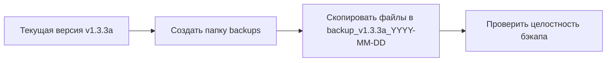

# План обновления версии и создания бэкапа

## Анализ текущего состояния

### Текущая версия
- **Версия:** v1.3.3a (альфа)
- **Дата последнего релиза:** 2026-04-21

### Реализованные изменения (после v1.3.3)
Добавлена новая функциональность из первой задачи плана:

1. **Чекбокс "Запускать сессию в Терминале (для Windows 10)"**
   - Расположение: строка 343 в [`ClaudeCodeLauncher.ahk`](../ClaudeCodeLauncher.ahk:343)
   - Неактивен в Windows 11 (автоматически)
   - Сохраняет состояние в конфиге

2. **Автоматическая установка Windows Terminal**
   - Проверка установки через функцию [`IsWindowsTerminalInstalled()`](../ClaudeCodeLauncher.ahk:521)
   - Установка через winget при первом включении чекбокса
   - Статусные сообщения: "Установка Терминала...", "Терминал установлен"
   - Обработка ошибок установки

3. **Обновлённый текст чекбокса новой вкладки**
   - Изменён на: "Запускать в новой вкладке (только в Терминале)"
   - Строка 353 в [`ClaudeCodeLauncher.ahk`](../ClaudeCodeLauncher.ahk:353)

## Определение новой версии

### Согласно системе версионирования проекта:
- **X** (мажор) - полностью играбельный функционал
- **Y** (минор) - накопление небольших изменений
- **Z** (патч) - небольшие изменения, исправления, улучшения
- **Суффикс 'a'** - альфа-версия (снимается после тестирования)

### Рекомендация по версии:
**v1.3.4** (без суффикса 'a', если функционал протестирован)

**Обоснование:**
- Это патч-релиз (Z+1), так как добавлена одна новая функция
- Функционал завершён и работает
- Изменения не ломают существующую функциональность
- Если требуется тестирование → **v1.3.4a**

## План действий

### 1. Создание бэкапа



**Файлы для бэкапа:**
- [`ClaudeCodeLauncher.ahk`](../ClaudeCodeLauncher.ahk:1) - основной скрипт
- [`ClaudeCodeLauncher.exe`](../ClaudeCodeLauncher.exe:1) - скомпилированная версия
- [`CHANGELOG.md`](../CHANGELOG.md:1) - история изменений
- [`README.md`](../README.md:1) - документация
- [`cc_launcher.ini`](../cc_launcher.ini:1) - конфигурация (опционально)

**Структура бэкапа:**
```
backups/
└── backup_v1.3.3a_2026-04-27/
    ├── ClaudeCodeLauncher.ahk
    ├── ClaudeCodeLauncher.exe
    ├── CHANGELOG.md
    ├── README.md
    └── cc_launcher.ini
```

### 2. Обновление версии в коде

**Файл:** [`ClaudeCodeLauncher.ahk`](../ClaudeCodeLauncher.ahk:1)

**Изменения:**
- Строка 11: `;@Ahk2Exe-SetVersion 1.3.3a` → `;@Ahk2Exe-SetVersion 1.3.4`
- Строка 14: `SCRIPT_VERSION := "v1.3.3a"` → `SCRIPT_VERSION := "v1.3.4"`

### 3. Обновление CHANGELOG.md

**Добавить новую секцию:**

```markdown
## v1.3.4 (2026-04-27)
- Добавлен чекбокс "Запускать сессию в Терминале (для Windows 10)"
- Автоматическая установка Windows Terminal через winget при первом включении
- Изменён текст чекбокса: "Запускать в новой вкладке (только в Терминале)"
- Чекбокс Windows Terminal неактивен в Windows 11 (Terminal используется по умолчанию)
```

### 4. Проверка корректности

**Чек-лист:**
- [ ] Версия обновлена в обоих местах [`ClaudeCodeLauncher.ahk`](../ClaudeCodeLauncher.ahk:1)
- [ ] CHANGELOG.md содержит новую секцию с правильной датой
- [ ] Бэкап создан и содержит все необходимые файлы
- [ ] Дата в CHANGELOG соответствует текущей дате
- [ ] Формат версии соответствует семантическому версионированию

## Альтернативные варианты версии

### Вариант 1: v1.3.4a (альфа)
**Если:** требуется дополнительное тестирование функционала
**Плюсы:** безопасность, возможность найти баги
**Минусы:** требует дополнительного релиза для снятия 'a'

### Вариант 2: v1.3.4 (стабильная)
**Если:** функционал протестирован и работает корректно
**Плюсы:** сразу стабильная версия
**Минусы:** нет

### Вариант 3: v1.4.0 (минорная)
**Если:** считать добавление Windows Terminal поддержки значительным изменением
**Плюсы:** подчёркивает важность изменений
**Минусы:** может быть избыточно для одной функции

## Рекомендация

**Предлагаю версию: v1.3.4**

**Причины:**
1. Функционал завершён и реализован
2. Это логичное продолжение патч-релизов
3. Изменения не требуют мажорного или минорного обновления
4. Соответствует принятой в проекте системе версионирования

## Следующие шаги после утверждения

1. Создать бэкап текущей версии
2. Обновить версию в коде
3. Обновить CHANGELOG.md
4. Перекомпилировать .exe файл (если требуется)
5. Протестировать новую версию
6. Создать git commit с тегом v1.3.4
